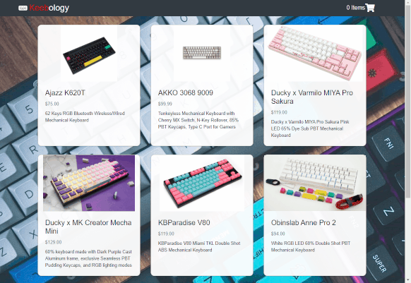

# wicked-sales.js
A full stack Node.js and React shopping cart app for mechanical keyboard enthusiasts.

## Technologies Used
- React.js
- JavaScript
- PostgreSQL
- Node.js
- npm
- Webpack
- Babel
- Express
- HTML 5
- CSS3
- Bootstrap 4
- JSON

## Live Demo

Try the application live at [https://keebology.keenanng.com/](https://keebology.keenanng.com/)

## Preview
  <p align="center">
    
  </p>

## Features

- User can view the products for sale
- User can view the details of a product
- User can add a product to their shopping cart
- User can view their cart summary
- User can place an order

## Development

#### Getting Started

1. Clone the repository.

    ```shell
    git clone https://github.com/dotkeenan/wicked-sales-js.git
    cd wicked-sales-js
    ```

1. Install all dependencies with NPM.

    ```shell
    npm install
    ```

1. Run the webpack development server.

    ```shell
    npm run dev
    ```

1. Once started you can view the application by opening http://localhost:3000 in your browser.
